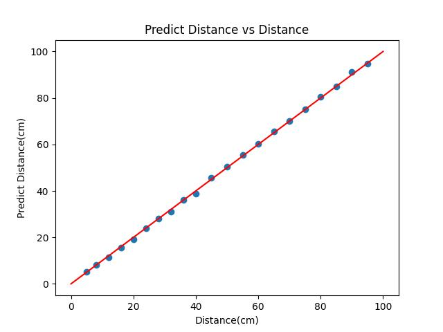

## Description

This project is to do analysis based on VNA S parameters data by converting the frequency domain signal to the time domain signal. 

What we do:

* range detection

## File Structure

### range_detection
```
📦 .
┣ 📂 data
┃ ┣ 📄 05.S2P
┃ ┗ 📄 ...
┣ 📂 signal
┃ ┣ 📄 5.txt
┃ ┣ 📄 MC.txt
┃ ┣ 📄 signal.xlsx
┃ ┣ 📄 t.txt
┃ ┣ 📄 train.csv
┃ ┣ 📄 t0.csv
┃ ┗...
┣ 📂 fig
┣ 📄 flight_time_get.py
┣ 📄 freq2time.py
┣ 📄 readme.md
┣ 📄 system_delay_train.py
┗ 📄 time_domain_signal_show.m
```

* data folder contains the raw data .S2P files from the VNA.
* signal folder contains the processed data, including the time domain signal, the system delay, and the frequency domain signal. **System delay is t0**
* fig folder contains the figures.
* flight_time_get.py is the script to get the flight time from the time domain signal.
* freq2time.py is the script to convert the frequency domain signal to the time domain signal.
* system_delay_train.py is the script to get the system delay by random search training.
* time_domain_signal_show.m is the script to show the time domain signal.


#### Result


Range detection performance:


offset: 1.15%

| Ground Truth - Distance (cm) | Predict Distance (cm) |
|-----------------------------:|----------------------:|
| 5.0                         | 5.26                  |
| 8.0                         | 8.28                  |
| 12.0                        | 11.44                 |
| 16.0                        | 15.51                 |
| 20.0                        | 19.08                 |
| 24.0                        | 23.86                 |
| 28.0                        | 27.98                 |
| 32.0                        | 31.12                 |
| 36.0                        | 35.99                 |
| 40.0                        | 38.80                 |
| 45.0                        | 45.70                 |
| 50.0                        | 50.38                 |
| 55.0                        | 55.39                 |
| 60.0                        | 60.16                 |
| 65.0                        | 65.72                 |
| 70.0                        | 70.00                 |
| 75.0                        | 75.13                 |
| 80.0                        | 80.41                 |
| 85.0                        | 84.97                 |
| 90.0                        | 91.25                 |
| 95.0                        | 94.80                 |

System Delay $t_0$: 1.52e-09s
Best offset in TrainSet: 1.84%
Best offset in TestSet: 0.95%
Best offset in AllSet: 1.62%

Notice: Different system will have different system delay.